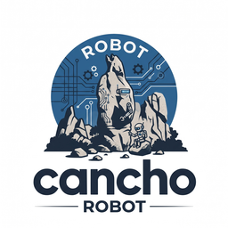

# cancho-robot

**A robot arm controller whose authority you can check.** Research into driving a real arm, the SO-101 arms of an [XLeRobot](https://github.com/Vector-Wangel/XLeRobot), from [cancho](https://github.com/alpibrusl/cancho): the Feetech servo bus, calibration, kinematics and a safety core (workspace, joint limits, collisions, speed), with an authority report the compiler derives. The question it exists to answer: **can the compiler prove that the only thing able to move the arms is the safety core**, and that nothing else (a teleoperator, a learned policy, a second program) can reach the servo bus?

**Status: research, design stage. Nothing is built yet.** There is a README, a logo and an epic with its tasks, and no code, no measurement and no claim beyond what is written here. The plan and its tasks are in the epic (see the issues). Speed of progress is not a goal; a result, positive or negative, written down with its measurement, is.

## Why

The arms are driven today from Python ([lex-robot](https://github.com/alpibrusl/lex-robot), on top of [LeRobot](https://github.com/huggingface/lerobot)). In two weeks of running them on real hardware, the defects that mattered were not about speed. They were about **authority**:

- two programs holding the same servo bus at once (a web UI and a recorder, each with its own idea of where the arm is);
- a safety check that every path was supposed to go through, and a recording path that did not;
- a workspace bound written in the robot's frame and checked in each arm's own frame, so a resting arm was "outside" its grant;
- a bus lock held for a whole move, which starved the recorder; and a re-entrant lock that let the same thread through a check meant to stop it;
- an inverse-kinematics solver that linearised around a stale pose and asked one joint for 140 degrees to move the gripper 1 cm.

Each was found by a person, on the robot, after the fact. cancho's linear ownership and capability-typed effects are built to turn exactly this class into compile errors: one owner of a bus, effects in the signature, frames as distinct types. This project tests that claim on a machine that can break things.

## Intended scope (v1)

A controller for one SO-101 arm, then both:

- the serial bus: raw mode at 1 Mbaud on macOS and Linux, and the Feetech STS protocol (ping, read, write, sync read, sync write), bounded and total;
- calibration from the existing LeRobot calibration files: raw ticks to the same normalised degrees LeRobot reports;
- forward and inverse kinematics for the SO-101, checked against the solver LeRobot uses;
- a safety core every motion goes through: the workspace bound with typed frames, joint limits, a capsule collision model (tower, cart, the other arm), a speed limit and a deadman;
- terminal teleoperation by keyboard, joint by joint, at 50 to 100 Hz;
- a local boundary for everything that stays in Python (cameras, recording, training, learned policies): it can ask for motion and read state, and cannot reach the bus;
- operable by an agent: `introspect` and `skill`, errors as data with rule tags, and a `check` that says what a motion would do without sending it.

Not in v1: cameras, writing datasets, training, running a policy (all stay in Python), the wheeled base and the tower, and a real-time guarantee.

## The question that decides the headline

The report should say *which buses* the controller can touch, the way cancho-dns wanted it to name its upstreams. A serial port is a file, and cancho can open a file under a path-narrowed capability; but putting it in raw mode at a non-standard speed needs `tcsetattr` and, on macOS, the `IOSSIOSPEED` ioctl, which today means a foreign call. A foreign call is reported symbol by symbol, not device by device. So either cancho grows a serial capability (filed upstream once the first spike has measured what is needed), or v1 says plainly that its device set is enforced in code. Until that is settled, "names the exact buses" is a target, not a claim.

## What we expect, stated before measuring

The bus runs at 1 Mbaud, a servo answers a read in a median of 0.33 ms (measured by lex-robot's bus check on this robot), and the Python keyboard teleoperation already runs at 30 Hz and feels smooth. The aim is not speed. It is a controller whose authority report, safety refusals and kinematics are each checked against an independent reference (LeRobot reading the same bus, its solver on the same poses), with every difference written down.

## Contributing

Design before code, in `docs/design.md`, with claims measured; a gate is fixed before the code it judges and must be able to fail; a claim that turns out false is corrected in place. Hardware work has its own rules in the epic: read before write, an operator at the e-stop for anything that moves, and no camera image in the repository.

## Licence

[EUPL-1.2](LICENSE).
